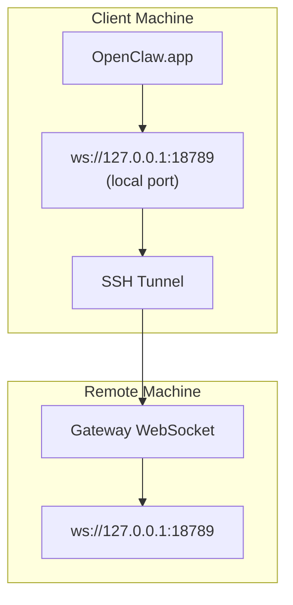

<!-- SNAPSHOT: source_url=https://docs.openclaw.ai/gateway/remote-gateway-readme.md; fetched_at=2026-02-20T10:29:20.384Z; sha256=d42c6399f69950d32b48a0d86bf52635ec83915c71d8e7665ce0d541964b8870; content_type=text/markdown; charset=utf-8; status=ok -->

> ## Documentation Index
> Fetch the complete documentation index at: https://docs.openclaw.ai/llms.txt
> Use this file to discover all available pages before exploring further.

# Remote Gateway Setup

# Running OpenClaw\.app with a Remote Gateway

OpenClaw\.app uses SSH tunneling to connect to a remote gateway. This guide shows you how to set it up.

## Overview



## Quick Setup

### Step 1: Add SSH Config

Edit `~/.ssh/config` and add:

```ssh  theme={"theme":{"light":"min-light","dark":"min-dark"}}
Host remote-gateway
    HostName <REMOTE_IP>          # e.g., 172.27.187.184
    User <REMOTE_USER>            # e.g., jefferson
    LocalForward 18789 127.0.0.1:18789
    IdentityFile ~/.ssh/id_rsa
```

Replace `<REMOTE_IP>` and `<REMOTE_USER>` with your values.

### Step 2: Copy SSH Key

Copy your public key to the remote machine (enter password once):

```bash  theme={"theme":{"light":"min-light","dark":"min-dark"}}
ssh-copy-id -i ~/.ssh/id_rsa <REMOTE_USER>@<REMOTE_IP>
```

### Step 3: Set Gateway Token

```bash  theme={"theme":{"light":"min-light","dark":"min-dark"}}
launchctl setenv OPENCLAW_GATEWAY_TOKEN "<your-token>"
```

### Step 4: Start SSH Tunnel

```bash  theme={"theme":{"light":"min-light","dark":"min-dark"}}
ssh -N remote-gateway &
```

### Step 5: Restart OpenClaw\.app

```bash  theme={"theme":{"light":"min-light","dark":"min-dark"}}
# Quit OpenClaw.app (⌘Q), then reopen:
open /path/to/OpenClaw.app
```

The app will now connect to the remote gateway through the SSH tunnel.

***

## Auto-Start Tunnel on Login

To have the SSH tunnel start automatically when you log in, create a Launch Agent.

### Create the PLIST file

Save this as `~/Library/LaunchAgents/bot.molt.ssh-tunnel.plist`:

```xml  theme={"theme":{"light":"min-light","dark":"min-dark"}}
<?xml version="1.0" encoding="UTF-8"?>
<!DOCTYPE plist PUBLIC "-//Apple//DTD PLIST 1.0//EN" "http://www.apple.com/DTDs/PropertyList-1.0.dtd">
<plist version="1.0">
<dict>
    <key>Label</key>
    <string>bot.molt.ssh-tunnel</string>
    <key>ProgramArguments</key>
    <array>
        <string>/usr/bin/ssh</string>
        <string>-N</string>
        <string>remote-gateway</string>
    </array>
    <key>KeepAlive</key>
    <true/>
    <key>RunAtLoad</key>
    <true/>
</dict>
</plist>
```

### Load the Launch Agent

```bash  theme={"theme":{"light":"min-light","dark":"min-dark"}}
launchctl bootstrap gui/$UID ~/Library/LaunchAgents/bot.molt.ssh-tunnel.plist
```

The tunnel will now:

* Start automatically when you log in
* Restart if it crashes
* Keep running in the background

Legacy note: remove any leftover `com.openclaw.ssh-tunnel` LaunchAgent if present.

***

## Troubleshooting

**Check if tunnel is running:**

```bash  theme={"theme":{"light":"min-light","dark":"min-dark"}}
ps aux | grep "ssh -N remote-gateway" | grep -v grep
lsof -i :18789
```

**Restart the tunnel:**

```bash  theme={"theme":{"light":"min-light","dark":"min-dark"}}
launchctl kickstart -k gui/$UID/bot.molt.ssh-tunnel
```

**Stop the tunnel:**

```bash  theme={"theme":{"light":"min-light","dark":"min-dark"}}
launchctl bootout gui/$UID/bot.molt.ssh-tunnel
```

***

## How It Works

| Component                            | What It Does                                                 |
| ------------------------------------ | ------------------------------------------------------------ |
| `LocalForward 18789 127.0.0.1:18789` | Forwards local port 18789 to remote port 18789               |
| `ssh -N`                             | SSH without executing remote commands (just port forwarding) |
| `KeepAlive`                          | Automatically restarts tunnel if it crashes                  |
| `RunAtLoad`                          | Starts tunnel when the agent loads                           |

OpenClaw\.app connects to `ws://127.0.0.1:18789` on your client machine. The SSH tunnel forwards that connection to port 18789 on the remote machine where the Gateway is running.
