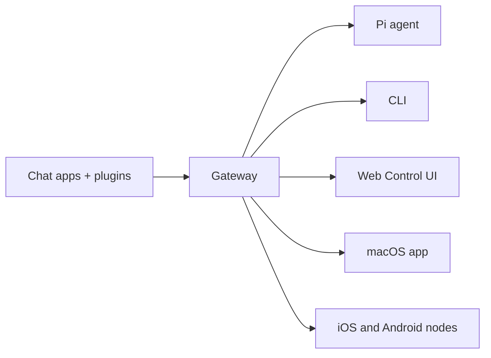

<!-- SNAPSHOT: source_url=https://docs.openclaw.ai/index.md; fetched_at=2026-02-20T10:29:21.500Z; sha256=be5fc30be9fe46331eca6e4c7a55dfb839c2ca29a0682aad476a4f6ce5134d31; content_type=text/markdown; charset=utf-8; status=ok -->

> ## Documentation Index
> Fetch the complete documentation index at: https://docs.openclaw.ai/llms.txt
> Use this file to discover all available pages before exploring further.

# OpenClaw

# OpenClaw 🦞

<p align="center">
  

  
</p>

> *"EXFOLIATE! EXFOLIATE!"* — A space lobster, probably

<p align="center">
  <strong>Any OS gateway for AI agents across WhatsApp, Telegram, Discord, iMessage, and more.</strong><br />
  Send a message, get an agent response from your pocket. Plugins add Mattermost and more.
</p>

<Columns>
  <Card title="Get Started" href="/start/getting-started" icon="rocket">
    Install OpenClaw and bring up the Gateway in minutes.
  </Card>

  <Card title="Run the Wizard" href="/start/wizard" icon="sparkles">
    Guided setup with `openclaw onboard` and pairing flows.
  </Card>

  <Card title="Open the Control UI" href="/web/control-ui" icon="layout-dashboard">
    Launch the browser dashboard for chat, config, and sessions.
  </Card>
</Columns>

## What is OpenClaw?

OpenClaw is a **self-hosted gateway** that connects your favorite chat apps — WhatsApp, Telegram, Discord, iMessage, and more — to AI coding agents like Pi. You run a single Gateway process on your own machine (or a server), and it becomes the bridge between your messaging apps and an always-available AI assistant.

**Who is it for?** Developers and power users who want a personal AI assistant they can message from anywhere — without giving up control of their data or relying on a hosted service.

**What makes it different?**

* **Self-hosted**: runs on your hardware, your rules
* **Multi-channel**: one Gateway serves WhatsApp, Telegram, Discord, and more simultaneously
* **Agent-native**: built for coding agents with tool use, sessions, memory, and multi-agent routing
* **Open source**: MIT licensed, community-driven

**What do you need?** Node 22+, an API key (Anthropic recommended), and 5 minutes.

## How it works



The Gateway is the single source of truth for sessions, routing, and channel connections.

## Key capabilities

<Columns>
  <Card title="Multi-channel gateway" icon="network">
    WhatsApp, Telegram, Discord, and iMessage with a single Gateway process.
  </Card>

  <Card title="Plugin channels" icon="plug">
    Add Mattermost and more with extension packages.
  </Card>

  <Card title="Multi-agent routing" icon="route">
    Isolated sessions per agent, workspace, or sender.
  </Card>

  <Card title="Media support" icon="image">
    Send and receive images, audio, and documents.
  </Card>

  <Card title="Web Control UI" icon="monitor">
    Browser dashboard for chat, config, sessions, and nodes.
  </Card>

  <Card title="Mobile nodes" icon="smartphone">
    Pair iOS and Android nodes with Canvas support.
  </Card>
</Columns>

## Quick start

<Steps>
  <Step title="Install OpenClaw">
    ```bash  theme={"theme":{"light":"min-light","dark":"min-dark"}}
    npm install -g openclaw@latest
    ```
  </Step>

  <Step title="Onboard and install the service">
    ```bash  theme={"theme":{"light":"min-light","dark":"min-dark"}}
    openclaw onboard --install-daemon
    ```
  </Step>

  <Step title="Pair WhatsApp and start the Gateway">
    ```bash  theme={"theme":{"light":"min-light","dark":"min-dark"}}
    openclaw channels login
    openclaw gateway --port 18789
    ```
  </Step>
</Steps>

Need the full install and dev setup? See [Quick start](/start/quickstart).

## Dashboard

Open the browser Control UI after the Gateway starts.

* Local default: [http://127.0.0.1:18789/](http://127.0.0.1:18789/)
* Remote access: [Web surfaces](/web) and [Tailscale](/gateway/tailscale)

<p align="center">
  
</p>

## Configuration (optional)

Config lives at `~/.openclaw/openclaw.json`.

* If you **do nothing**, OpenClaw uses the bundled Pi binary in RPC mode with per-sender sessions.
* If you want to lock it down, start with `channels.whatsapp.allowFrom` and (for groups) mention rules.

Example:

```json5  theme={"theme":{"light":"min-light","dark":"min-dark"}}
{
  channels: {
    whatsapp: {
      allowFrom: ["+15555550123"],
      groups: { "*": { requireMention: true } },
    },
  },
  messages: { groupChat: { mentionPatterns: ["@openclaw"] } },
}
```

## Start here

<Columns>
  <Card title="Docs hubs" href="/start/hubs" icon="book-open">
    All docs and guides, organized by use case.
  </Card>

  <Card title="Configuration" href="/gateway/configuration" icon="settings">
    Core Gateway settings, tokens, and provider config.
  </Card>

  <Card title="Remote access" href="/gateway/remote" icon="globe">
    SSH and tailnet access patterns.
  </Card>

  <Card title="Channels" href="/channels/telegram" icon="message-square">
    Channel-specific setup for WhatsApp, Telegram, Discord, and more.
  </Card>

  <Card title="Nodes" href="/nodes" icon="smartphone">
    iOS and Android nodes with pairing and Canvas.
  </Card>

  <Card title="Help" href="/help" icon="life-buoy">
    Common fixes and troubleshooting entry point.
  </Card>
</Columns>

## Learn more

<Columns>
  <Card title="Full feature list" href="/concepts/features" icon="list">
    Complete channel, routing, and media capabilities.
  </Card>

  <Card title="Multi-agent routing" href="/concepts/multi-agent" icon="route">
    Workspace isolation and per-agent sessions.
  </Card>

  <Card title="Security" href="/gateway/security" icon="shield">
    Tokens, allowlists, and safety controls.
  </Card>

  <Card title="Troubleshooting" href="/gateway/troubleshooting" icon="wrench">
    Gateway diagnostics and common errors.
  </Card>

  <Card title="About and credits" href="/reference/credits" icon="info">
    Project origins, contributors, and license.
  </Card>
</Columns>
