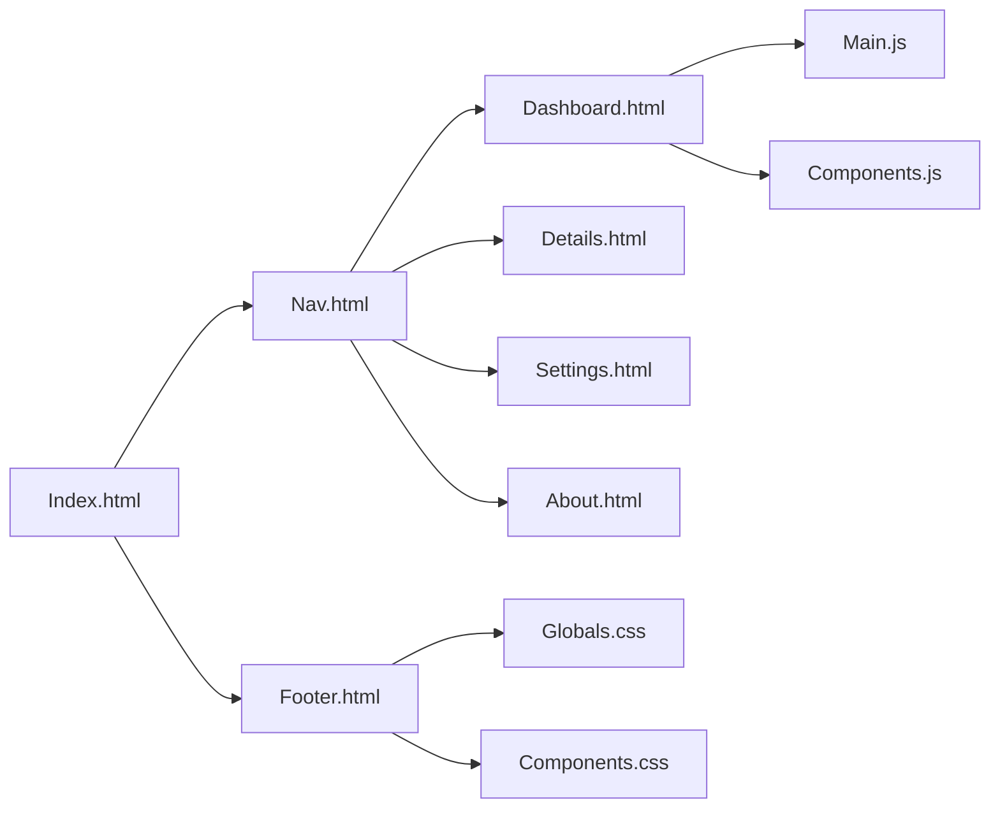

## Project Overview

The project will be developed using the EASY tech stack, which consists of Vanilla HTML, CSS, and JavaScript. The application will be a static multi-page site with 4-6 separate HTML pages, shared navigation, and rich interactive content.

## File Structure

The file structure will be organized as follows:

* `index.html`: The main entry point of the application.
* `pages/`: A directory containing the individual HTML pages.
	+ `dashboard.html`
	+ `details.html`
	+ `settings.html`
	+ `about.html`
* `components/`: A directory containing reusable HTML components.
	+ `nav.html`
	+ `footer.html`
* `styles/`: A directory containing CSS files.
	+ `globals.css`
	+ `components.css`
* `scripts/`: A directory containing JavaScript files.
	+ `main.js`
	+ `components.js`
* `data/`: A directory containing JSON data files (optional).

## Page Content

Each page will contain specific content and interactive features:

* `index.html`: A dashboard page with a hero section, a features section, and a call-to-action button.
* `dashboard.html`: A dashboard page with a data table, a chart, and a filter/search bar.
* `details.html`: A details page with a product description, a product image, and a review section.
* `settings.html`: A settings page with a form, a toggle button, and a save button.
* `about.html`: An about page with a team section, a mission statement, and a contact form.

## Shared Components

The following shared components will be used across multiple pages:

* `nav.html`: A navigation bar with a logo, menu items, and a search bar.
* `footer.html`: A footer with copyright information, social media links, and a contact form.

## CSS Layout Strategy

The CSS layout strategy will use custom properties for theming and a utility-first approach. The `globals.css` file will define global styles, while the `components.css` file will define styles for individual components.

## JavaScript Features

The JavaScript features will include:

* Interactive navigation bar with a dropdown menu.
* Filter/search bar on the dashboard page.
* Form validation on the settings and about pages.
* Toggle button on the settings page.
* Chart and data table on the dashboard page.

## Data Structures

The data structures will be simple JSON objects or arrays, stored in the `data/` directory. For example:

```json
// data/products.json
[
  {
    "id": 1,
    "name": "Product 1",
    "description": "This is product 1",
    "price": 10.99
  },
  {
    "id": 2,
    "name": "Product 2",
    "description": "This is product 2",
    "price": 9.99
  }
]
```

## FORGE EXECUTION CONTRACT

The following is the FORGE EXECUTION CONTRACT:

**File List**

* `index.html`
* `pages/dashboard.html`
* `pages/details.html`
* `pages/settings.html`
* `pages/about.html`
* `components/nav.html`
* `components/footer.html`
* `styles/globals.css`
* `styles/components.css`
* `scripts/main.js`
* `scripts/components.js`
* `data/products.json` (optional)

**Architecture**

* Multi-page static site with shared navigation and footer components.
* Interactive features on each page.

**Component Structure**

* Reusable HTML components in the `components/` directory.
* CSS styles for components in the `styles/` directory.

**CSS Layout Strategy**

* Custom properties for theming.
* Utility-first approach.

**Data Structures**

* Simple JSON objects or arrays.

**Acceptance Criteria**

* The application renders correctly in different browsers and devices.
* The application's UI is responsive and accessible.
* The application's state is managed correctly using JavaScript.
* The application's performance is optimized.

**Measurable Acceptance Criteria**

* The application loads within 2 seconds on a standard internet connection.
* The application's UI is responsive and accessible on at least 80% of the most commonly used devices and browsers.
* The application's performance is optimized to use less than 100MB of memory on a standard device.

## Decision Plan

The decision plan is to:

1. Create the file structure and add the necessary files.
2. Design the UI and add the necessary HTML, CSS, and JavaScript code.
3. Implement the interactive features on each page.
4. Test the application and ensure it meets the acceptance criteria.

## Bootstrap Choice

No bootstrap will be used. Instead, a custom CSS framework will be created using a utility-first approach.

## Diagrams

The following diagrams illustrate the file structure and component relationships:



Note: The above diagram is a simple representation of the file structure and component relationships. It may not be exhaustive or accurate.