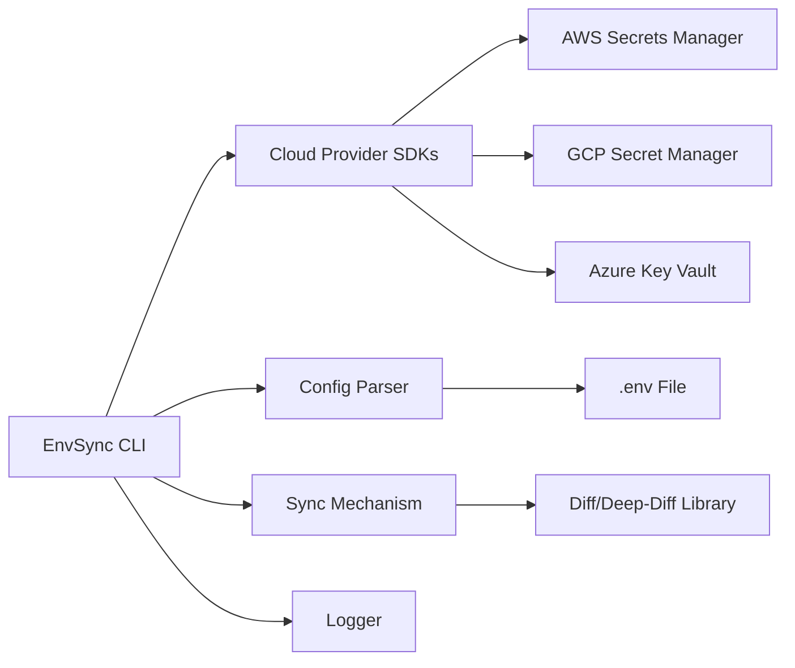

## 1. System Overview

The EnvSync CLI is a command-line interface tool designed to bidirectional-sync local .env files with cloud secret managers, including AWS Secrets Manager, GCP Secret Manager, and Azure Key Vault. This tool aims to prevent manual copy-paste errors, configuration drift, and security risks associated with managing secrets across multiple cloud environments. By automating the syncing process, EnvSync CLI can reduce errors, save time, and improve overall security.

## 2. Component Diagram (Mermaid)



## 3. Data Flow

The data flow of the EnvSync CLI can be described as follows:

- The user initiates a sync operation using the EnvSync CLI.
- The CLI uses cloud provider SDKs to authenticate with the respective cloud secret managers (AWS Secrets Manager, GCP Secret Manager, Azure Key Vault).
- The CLI reads the local .env file using a configuration file parser.
- The CLI retrieves secrets from the cloud secret managers using the SDKs.
- The CLI compares the local .env file with the cloud secrets using a diff/deep-diff library.
- The CLI syncs the differences between the local .env file and the cloud secrets.
- The CLI logs the sync operation using a logger.

## 4. File/Folder Structure

The proposed file/folder structure for the EnvSync CLI is:

```plaintext
envsync-cli/
|---- src/
|       |---- main.py
|       |---- cloud_providers/
|       |       |---- aws.py
|       |       |---- gcp.py
|       |       |---- azure.py
|       |---- config_parser.py
|       |---- sync_mechanism.py
|       |---- logger.py
|---- tests/
|       |---- test_main.py
|       |---- test_cloud_providers.py
|       |---- test_config_parser.py
|       |---- test_sync_mechanism.py
|---- requirements.txt
|---- README.md
```

## 5. Key Technical Decisions + Justification

### Programming Language

* **Decision:** Python
* **Justification:** Python is chosen due to its extensive libraries and SDKs for cloud providers, making it easier to integrate with AWS Secrets Manager, GCP Secret Manager, and Azure Key Vault.

### Cloud Provider SDKs

* **Decision:** Use existing cloud provider SDKs (e.g., `aws-sdk`, `google-cloud-secretmanager`, `azure-identity` and `azure-keyvault-secrets`)
* **Justification:** Leveraging existing SDKs simplifies authentication and secret management with cloud providers.

### Configuration File Parsing

* **Decision:** Use `python-dotenv` for parsing and managing local .env files
* **Justification:** `python-dotenv` is a lightweight library that makes it easy to parse and manage .env files.

### Syncing Mechanism

* **Decision:** Implement a two-way sync using `deep-diff` to compare local and cloud configurations
* **Justification:** `deep-diff` is a powerful library for comparing complex data structures, making it suitable for syncing .env files with cloud secrets.

### Logger

* **Decision:** Use a built-in Python logger
* **Justification:** A built-in logger provides a simple and efficient way to log sync operations.

## 6. What FORGE Needs to Know to Start Coding

To start coding, FORGE needs to know:

* The project structure and organization
* The chosen programming language (Python) and required libraries
* The cloud provider SDKs to be used for authentication and secret management
* The configuration file parser to be used for .env files
* The syncing mechanism to be implemented for bidirectional sync
* The logger to be used for logging sync operations

By understanding these technical decisions and requirements, FORGE can begin developing the EnvSync CLI.