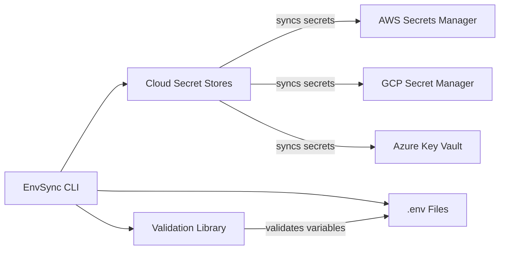

## 1. System Overview
The EnvSync CLI is a command-line utility designed to synchronize .env files with cloud secret stores (AWS Secrets Manager, GCP Secret Manager, Azure Key Vault) and validate required variables. This tool aims to prevent environment-related bugs and security issues by automating the synchronization process. It targets DevOps engineers and developers managing multi-environment configurations.

## 2. Component Diagram (Mermaid)

```mermaid
graph LR
    A[EnvSync CLI] --> B[Cloud Secret Stores]
    A --> C[.env Files]
    A --> D[Validation Library]
    B -->|syncs secrets| E[AWS Secrets Manager]
    B -->|syncs secrets| F[GCP Secret Manager]
    B -->|syncs secrets| G[Azure Key Vault]
    D -->|validates variables| C
```

## 3. Data Flow
The EnvSync CLI reads .env files and cloud secret stores, synchronizes secrets, and validates required variables. The data flow is as follows:
- Read .env file and extract required variables.
- Authenticate with cloud secret stores (AWS Secrets Manager, GCP Secret Manager, Azure Key Vault).
- Retrieve secrets from cloud secret stores.
- Synchronize secrets with .env file.
- Validate required variables using a validation library.

## 4. File/Folder Structure
```markdown
envsync-cli/
├── src/
│   ├── commands/
│   │   └── sync.ts
│   ├── cloud-providers/
│   │   ├── aws.ts
│   │   ├── gcp.ts
│   │   └── azure.ts
│   ├── validation/
│   │   └── validate.ts
│   ├── utils/
│   │   └── logger.ts
│   ├── index.ts
│   └── config.ts
├── tests/
│   ├── unit/
│   │   └── sync.test.ts
│   ├── integration/
│   │   └── cloud-providers.test.ts
│   └── validation.test.ts
├── .env
├── package.json
└── README.md
```

## 5. Key Technical Decisions + Justification
- **Node.js 20 + TypeScript**: Chosen for their popularity, maintainability, and compatibility with cloud provider SDKs.
- **Cloud provider SDKs**: Used for interacting with cloud secret stores (e.g., `aws-sdk`, `@google-cloud/secretmanager`, `@azure/identity`).
- **Validation library (Joi or Yup)**: Used for validating required variables.
- **Logger (Winston or Morgan)**: Used for logging errors and information.

## 6. Template/Bootstrap Plan
`node-cli`

## 7. FORGE EXECUTION CONTRACT
### Required Files FORGE Must Create/Modify
- `src/commands/sync.ts`
- `src/cloud-providers/aws.ts`
- `src/cloud-providers/gcp.ts`
- `src/cloud-providers/azure.ts`
- `src/validation/validate.ts`
- `src/utils/logger.ts`
- `src/index.ts`
- `src/config.ts`
- `tests/unit/sync.test.ts`
- `tests/integration/cloud-providers.test.ts`
- `tests/validation.test.ts`

### Minimum Test Targets
- Unit tests for individual components (e.g., `sync.ts`, `validate.ts`).
- Integration tests for cloud provider interactions.

### Acceptance Criteria
- The CLI tool successfully synchronizes .env files with at least two cloud secret stores.
- The tool validates required variables and reports errors for missing ones.
- The tool handles authentication and authorization for each cloud service.

### Non-Goals
- Support for more than three cloud secret providers in the initial release.

## 8. What FORGE Needs to Know to Start Coding
- The specific cloud provider SDKs to use (e.g., `aws-sdk`, `@google-cloud/secretmanager`, `@azure/identity`).
- The validation library to use (e.g., Joi, Yup).
- The logger to use (e.g., Winston, Morgan).
- Any specific configuration or environment variables required for the project.