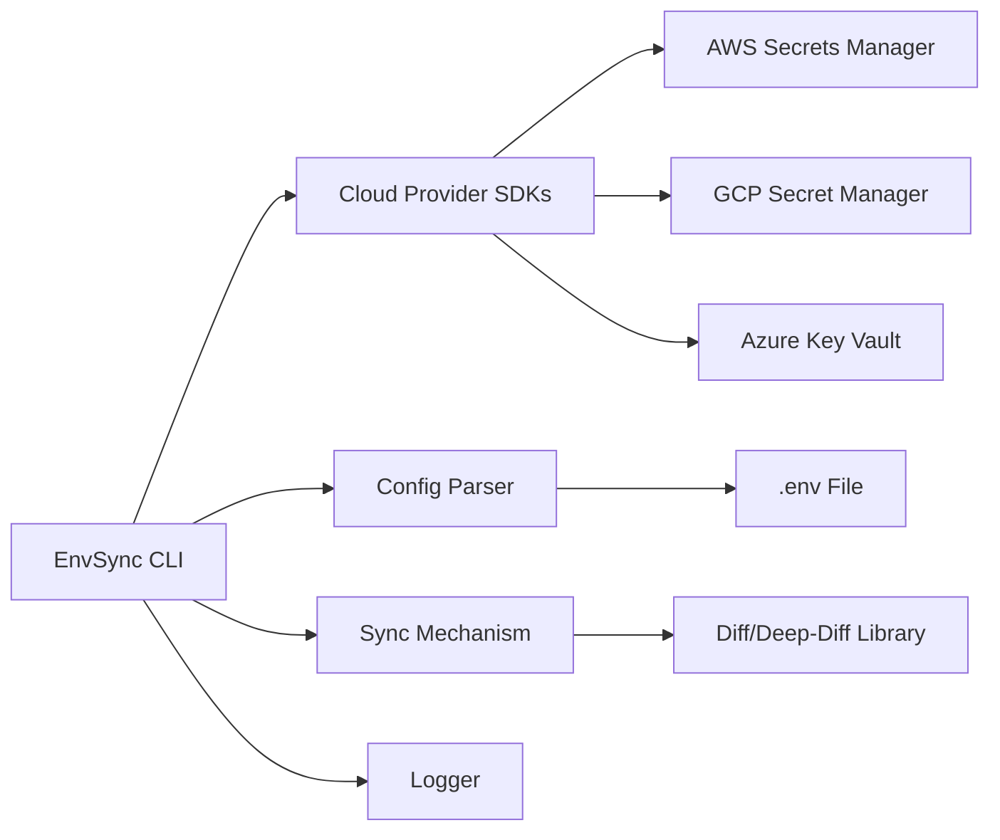

### 1. System Overview

The EnvSync CLI is an application designed to bidirectional-sync local `.env` files with cloud secret managers, such as AWS Secrets Manager, GCP Secret Manager, and Azure Key Vault. This project aims to prevent manual copy-paste errors, configuration drift, and security risks associated with managing secrets across multiple cloud environments.

### 2. Component Diagram (Mermaid)



### 3. Data Flow

The EnvSync CLI can be summarized as follows:

1. The user initiates a sync operation using the EnvSync CLI.
2. The CLI uses cloud provider SDKs to authenticate with the respective cloud secret managers (AWS Secrets Manager, GCP Secret Manager, Azure Key Vault).
3. The CLI reads the local `.env` file using a configuration file parser.
4. The CLI retrieves secrets from the cloud secret managers using the SDKs.
5. The CLI compares the local `.env` file with the cloud secrets using a diff/deep-diff library.
6. The CLI syncs the differences between the local `.env` file and the cloud secrets.
7. The CLI logs the sync operation using a logger.

### 4. File/Folder Structure

The proposed file/folder structure for the EnvSync CLI is:

```
envsync-cli/
|---- src/
|       |---- main.py
|       |---- cloud_providers/
|       |       |---- aws.py
|       |       |---- gcp.py
|       |       |---- azure.py
|       |---- config_parser.py
|       |---- sync_mechanism.py
|       |---- logger.py
|---- tests/
|       |---- test_main.py
|       |---- test_cloud_providers.py
|       |---- test_config_parser.py
|       |---- test_sync_mechanism.py
|---- requirements.txt
|---- README.md
```

### 5. Key Technical Decisions + Justification

#### Programming Language

* **Decision:** Python
  * **Justification:** Python is chosen due to its extensive libraries and SDKs for cloud providers, making it easier to integrate with AWS Secrets Manager, GCP Secret Manager, and Azure Key Vault.

#### Cloud Provider SDKs

* **Decision:** Use existing cloud provider SDKs (e.g., `aws-sdk`, `google-cloud-secretmanager`, `azure-identity` and `azure-keyvault-secrets`)
  * **Justification:** Leveraging existing SDKs simplifies authentication and secret management with cloud providers.

#### Configuration File Parsing

* **Decision:** Use `python-dotenv` for parsing and managing local `.env` files
  * **Justification:** `python-dotenv` is a lightweight library that makes it easy to parse and manage .env files.

#### Syncing Mechanism

* **Decision:** Implement a two-way sync using `deep-diff` to compare local and cloud configurations
  * **Justification:** `deep-diff` is a powerful library for comparing complex data structures, making it suitable for syncing .env files with cloud secrets.

### Dependencies

- python-dotenv (0.20.0): Configuration file parser for .env files.
- aws-sdk (8.196.0): AWS SDK libraries for authentication and secret management.
- google-cloud-secretmanager (47.0.0): GCP Secret Manager library.
- azure-identity (1.5.3): Azure Identity SDK for Python.
- azure-keyvault-secrets (12.0.0): Azure Key Vault Secrets SDK for Python.

### 6. What FORGE Needs to Know to Start Coding

To start coding, FORGE needs to know:

* The project structure and organization
* The chosen programming language (Python) and required libraries
* The cloud provider SDKs to be used for authentication and secret management
* The configuration file parser to be used for .env files
* The syncing mechanism to be implemented for bidirectional sync
* The logger to be used for logging sync operations

By understanding these technical decisions and requirements, FORGE can begin developing the EnvSync CLI.

### 7. Web Project Example (Minimal Scaffolding)

For a web project scaffold example:

```sh
# Create a new Node.js project
mkdir envsync-cli && cd $_
npm init -y

# Install necessary dependencies
npm install express dotenv axios cors @types/express @types/cors

# Set up the app entry file
touch src/app.js

# Initialize Express app and configure middleware
const express = require('express');
const app = express();
const port = 3000;

// Middleware setup
app.use(express.json());
app.use(cors());

// Routes configuration (for example, a simple route)
// app.get('/api/config', (req, res) => {
//   res.send({ data: 'Hello from EnvSync CLI!' });
// });

// Start the server
app.listen(port, () => {
  console.log(`Server is running on http://localhost:${port}`);
});
```

### Dependencies

- `express`: HTTP web application framework for Node.js.
- `dotenv`: Library to load environment variables from a `.env` file.
- `axios`: Asynchronous HTTP client for JavaScript and the browser.
- `cors`: Middleware for handling cross-origin requests.

This minimal scaffold includes basic setup for an Express server, middleware configuration, and routes. The actual implementation of sync mechanisms, error handling, and logging would require further development beyond this example.