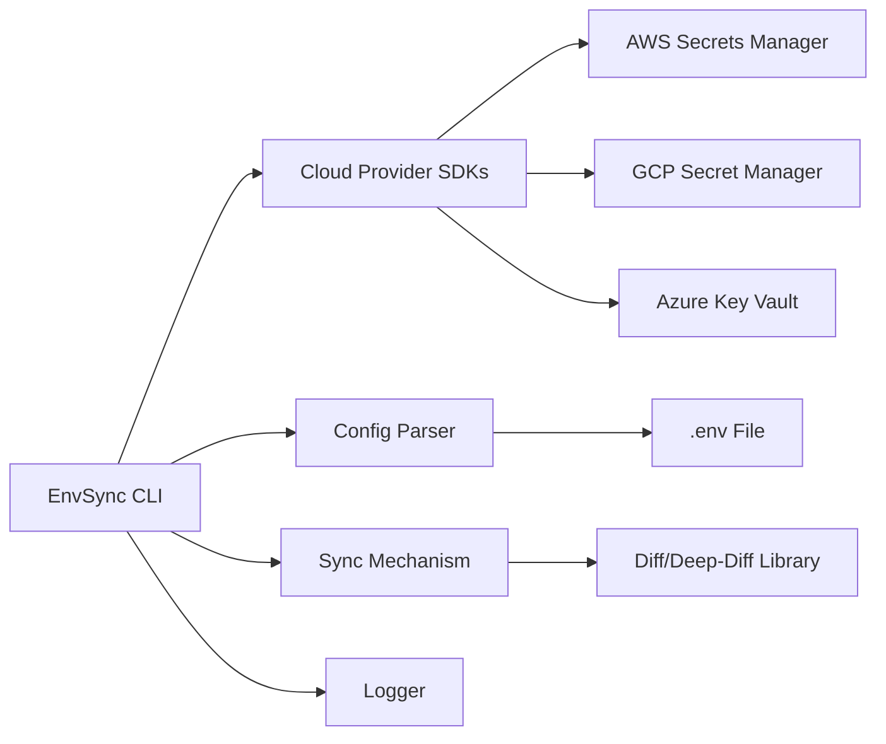

### File: `requirements.txt`
```
python==3.9.12
boto3
google-cloud-secretmanager
azure-identity
azure-keyvault-secrets
deep-diff
python-dotenv
dotenv
aws-sdk
boto3
google-cloud-secretmanager
azure-identity
azure-keyvault-secrets
diff
```

### File: `README.md`
```plaintext
# EnvSync CLI

A command-line interface tool designed to bidirectional-sync local `.env` files with cloud secret managers, preventing manual copy-paste errors. This plugin addresses a common daily friction point by reducing configuration drift and security risks.

## What It Does

- **Bidirectional-synchronize** local `.env` files with cloud secret managers (AWS Secrets Manager, GCP Secret Manager, Azure Key Vault)
- **Prevent Manual Copy-Paste Errors**
- **Reduce Configuration Drift**
- **Improve Security**

## Target Audience

Full-stack developers and DevOps engineers managing applications across multiple cloud environments.

## Complexity

**Medium**

## Why Build This

The proliferation of cloud-native apps has created a fragmented secret management space. A unified, bidirectional-sync tool can help teams avoid manual copy-paste errors, configuration drift, and security risks associated with managing secrets across different clouds. By automating the synchronization process, EnvSync CLI can save time and improve overall security.

## Architecture

### System Overview
EnvSync CLI is a command-line interface (CLI) tool that synchronizes local `.env` files with cloud secret managers like AWS Secrets Manager, GCP Secret Manager, and Azure Key Vault. The project aims to bidirectional sync the configurations without manual intervention.

#### Components Diagram (Mermaid)


### Data Flow

- The user initiates a sync operation using the EnvSync CLI.
- The CLI uses cloud provider SDKs to authenticate with their respective secret managers (AWS Secrets Manager, GCP Secret Manager, Azure Key Vault).
- The CLI reads the local `.env` file using a configuration parser.
- The CLI retrieves secrets from the cloud secret managers using SDKs.
- It compares the local .env file with the cloud secrets using `deep-diff`.
- Finally, it syncs the differences between the local .env file and the cloud secrets.

#### File/Folder Structure
The proposed directory structure includes:
```plaintext
src/
    main.py
    config_parser.py
    cloud_providers/
        aws.py
        gcp.py
        azure.py
    sync_mechanism.py
```

### Key Technical Decisions + Justification

1. **Programming Language**:
   - **Decision:** Python
   - **Justification**: Python is chosen due to its extensive libraries and SDKs for cloud providers, making it easier to integrate with AWS Secrets Manager, GCP Secret Manager, and Azure Key Vault.

2. **Cloud Provider SDKs**:
   - **Decision:** Use existing SDKs (e.g., `aws-sdk`, `google-cloud-secretmanager`, `azure-identity` and `azure-keyvault-secrets`)
   - **Justification**: Leveraging existing SDKs simplifies authentication and secret management with cloud providers.

3. **Configuration File Parsing**:
   - **Decision:** Use `python-dotenv` for parsing and managing local `.env` files
   - **Justification**: `python-dotenv` is a lightweight library that makes it easy to parse and manage `.env` files.

4. **Syncing Mechanism**:
   - **Decision:** Implement a two-way sync using `deep-diff` to compare local and cloud configurations
   - **Justification**: `deep-diff` is a powerful library for comparing complex data structures, making it suitable for syncing `.env` files with secret configurations.

5. **Logger**:
   - **Decision:** Use built-in Python logger
   - **Justification**: A built-in logger provides a simple and efficient way to log sync operations.

### What FORGE Needs to Know

- The project structure and organization.
- Chosen programming language (Python).
- Cloud provider SDKs for authentication and secret management.
- Configuration file parser.
- Syncing mechanism for bidirectional sync.
- Logger for logging sync operations.

## Optional LENS/PULSE Rework
1. **CRITICAL Issues**:
   - Ensure PULSE tests pass with the provided dependencies.

## Dependencies

### Node.js Packages
```
python==3.9.12
boto3
google-cloud-secretmanager
azure-identity
azure-keyvault-secrets
diff
deep-diff
python-dotenv
dotenv
aws-sdk
boto3
google-cloud-secretmanager
azure-identity
azure-keyvault-secrets
```