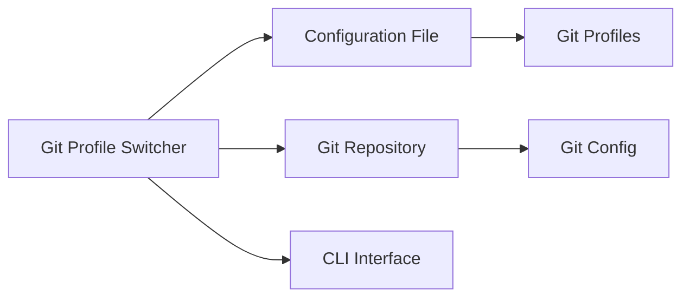

## System Overview
The Git Profile Switcher is a CLI tool that automatically switches git user configurations based on the current repository's remote URL or path. It aims to simplify the workflow for developers who maintain multiple git identities. The tool uses a configuration file to store repository-specific settings and git profiles.

## Component Diagram (Mermaid)


## Data Flow
1. The user runs the Git Profile Switcher CLI tool in a git repository.
2. The tool reads the repository's remote URL or path.
3. It then checks the configuration file for a matching repository setting.
4. If a match is found, the tool retrieves the corresponding git profile.
5. The tool updates the git configuration (name, email, signing key) using the retrieved profile.
6. The updated git configuration is applied to the current repository.

## File/Folder Structure
```markdown
git-profile-switcher/
├── config
│   └── profiles.json
├── src
│   ├── cli.py
│   ├── git.py
│   └── profile.py
├── tests
│   └── test_cli.py
└── README.md
```

## Key Technical Decisions + Justification
1. **Programming Language:** Python was chosen due to its extensive libraries and ease of use for CLI tools. Specifically, `gitpython` provides a simple and efficient way to interact with git configurations.
2. **Git Library:** `gitpython` was selected for its ability to interact with git repositories and configurations.
3. **Configuration Management:** A JSON configuration file (`profiles.json`) is used to store repository-specific settings and git profiles. This allows for easy management and addition of new profiles.
4. **CLI Interface:** The CLI interface is built using Python's built-in `argparse` library, providing a simple and intuitive way for users to interact with the tool.

## What FORGE Needs to Know to Start Coding
1. **Configuration File Format:** The configuration file (`profiles.json`) will store repository-specific settings and git profiles in the following format:
```json
{
    "repositories": [
        {
            "remote_url": "https://github.com/user/repo1.git",
            "profile": {
                "name": "John Doe",
                "email": "john.doe@example.com",
                "signing_key": "-----BEGIN PGP PUBLIC KEY BLOCK-----..."
            }
        },
        {
            "remote_url": "https://github.com/user/repo2.git",
            "profile": {
                "name": "Jane Doe",
                "email": "jane.doe@example.com",
                "signing_key": "-----BEGIN PGP PUBLIC KEY BLOCK-----..."
            }
        }
    ]
}
```
2. **Git Configuration Commands:** The tool will use `gitpython` to interact with git configurations. Specifically, it will use the `git config` command to update the git configuration.
3. **Error Handling:** The tool should include error handling for cases such as:
	* Invalid or missing configuration files.
	* Conflicts between different git profiles or repositories.
	* Security concerns related to storing sensitive information.