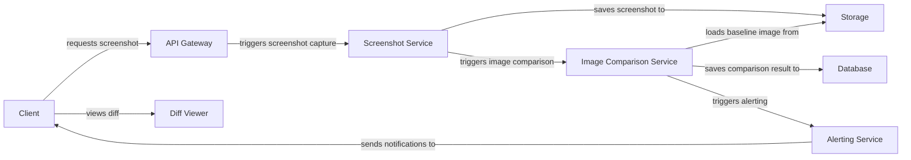

## System Overview

Pixel Pulse is a web service designed to capture screenshots of web pages on a schedule or on-demand and compare them pixel-by-pixel with a baseline to detect visual regressions. The service provides an interactive diff viewer and alerting system to help frontend developers and QA teams identify and resolve unintended UI changes. The system aims to simplify visual testing and ensure the quality of web applications.

## Component Diagram (Mermaid)

## Data Flow

1. **Client Request**: The client (frontend developer or QA team) sends a request to the API Gateway to capture a screenshot of a web page or compare it with a baseline.
2. **Screenshot Capture**: The API Gateway triggers the Screenshot Service to capture a screenshot of the web page using a headless browser (e.g., Puppeteer or Playwright).
3. **Image Storage**: The Screenshot Service saves the captured screenshot to a storage system (e.g., AWS S3 or Google Cloud Storage).
4. **Image Comparison**: The Screenshot Service triggers the Image Comparison Service to compare the captured screenshot with a baseline image stored in the storage system.
5. **Comparison Result**: The Image Comparison Service saves the comparison result to a database (e.g., MongoDB or PostgreSQL).
6. **Alerting**: The Image Comparison Service triggers the Alerting Service to send notifications to the client if a visual regression is detected.
7. **Diff Viewer**: The client can view the diff between the captured screenshot and the baseline image using the Diff Viewer.

## File/Folder Structure

* `api-gateway/`: API Gateway implementation (e.g., Node.js with Express.js)
* `screenshot-service/`: Screenshot Service implementation (e.g., Puppeteer or Playwright)
* `image-comparison-service/`: Image Comparison Service implementation (e.g., ImageMagick or OpenCV)
* `storage/`: Storage system implementation (e.g., AWS S3 or Google Cloud Storage)
* `database/`: Database implementation (e.g., MongoDB or PostgreSQL)
* `alerting-service/`: Alerting Service implementation (e.g., email or Slack notifications)
* `diff-viewer/`: Diff Viewer implementation (e.g., React or Angular)
* `tests/`: Unit tests and integration tests for each service

## Key Technical Decisions + Justification

* **Backend**: Node.js with Express.js or Next.js for building a scalable and performant server-side application.
* **Screenshot capture**: Puppeteer or Playwright for automating browser interactions and capturing screenshots.
* **Image comparison**: ImageMagick or OpenCV for performing pixel-by-pixel comparisons.
* **Database**: MongoDB or PostgreSQL for storing baseline images and comparison results.
* **Storage**: AWS S3 or Google Cloud Storage for storing screenshots and baseline images.
* **Alerting**: Email or Slack notifications for sending alerts to clients.

## What FORGE Needs to Know to Start Coding

To start coding, FORGE needs to know:

* The specific requirements for the API Gateway, Screenshot Service, Image Comparison Service, and Alerting Service.
* The chosen tech stack for each service (e.g., Node.js, Puppeteer, ImageMagick, etc.).
* The database schema for storing baseline images and comparison results.
* The storage system implementation details (e.g., AWS S3 or Google Cloud Storage).
* The alerting system implementation details (e.g., email or Slack notifications).
* The diff viewer implementation details (e.g., React or Angular).

With this information, FORGE can start designing and implementing the individual services and integrating them to build the Pixel Pulse system.