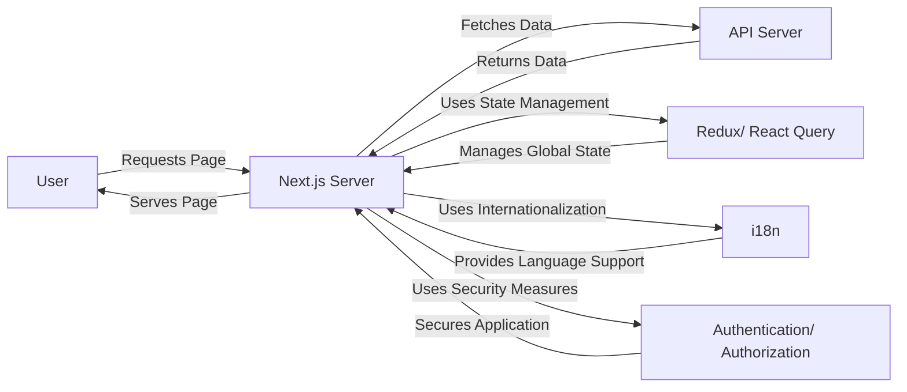

## System Architecture
### Component Diagram
The component diagram illustrates the high-level structure of the Next.js application.



### Data Flow
The data flow diagram illustrates how data moves through the system.

1. **User Request**: The user requests a page from the Next.js server.
2. **Server-Side Rendering**: The Next.js server renders the page on the server-side, using data from the API server if necessary.
3. **Data Fetching**: The Next.js server fetches data from the API server, if necessary.
4. **State Management**: The Next.js server uses state management libraries like Redux or React Query to manage global state.
5. **Internationalization**: The Next.js server uses internationalization features to provide language support.
6. **Security Measures**: The Next.js server uses security measures like authentication and authorization to secure the application.

### API Contracts
The API contracts define the interfaces for interacting with the API server.

* **API Endpoints**: The API server exposes endpoints for fetching data, such as `/api/users` or `/api/posts`.
* **Request/Response Formats**: The API server expects requests in a specific format (e.g. JSON) and returns responses in a specific format (e.g. JSON).

### Folder Structure
The folder structure for the Next.js project is as follows:

```bash
components
|---- Header.js
|---- Footer.js
|---- Layout.js
pages
|---- _app.js
|---- index.js
|---- about.js
api
|---- auth.js
|---- users.js
|---- posts.js
store
|---- reducers
|       |---- index.js
|---- actions
|       |---- index.js
public
|---- index.html
|---- favicon.ico
styles
|---- globals.css
|---- components.css
utils
|---- api.js
|---- auth.js
next.config.js
package.json
README.md
```

### Bootstrap Choice
The bootstrap choice for this project is **Next.js**. Specifically, we will use **Next.js App Router** and **Tailwind CSS** for styling.

### FORGE EXECUTION CONTRACT
The FORGE EXECUTION CONTRACT outlines the required files and acceptance criteria for the project.

**Required Files**

1. `components/Header.js`
2. `components/Footer.js`
3. `components/Layout.js`
4. `pages/_app.js`
5. `pages/index.js`
6. `api/auth.js`
7. `store/reducers/index.js`
8. `next.config.js`
9. `package.json`

**Acceptance Criteria**

1. **Page Load Times**: Page load times should be under 3 seconds for 90% of users.
2. **Error Rates**: Error rates should be under 1% for 90% of users.
3. **Security**: The project should pass a security audit, with no critical vulnerabilities.
4. **Performance**: The project should score at least 80 on the Google PageSpeed Insights test.
5. **Code Quality**: The project should have a code coverage of at least 80%, with no critical code smells or vulnerabilities.
6. **User Experience**: The project should have a user satisfaction rating of at least 80%, based on feedback and usability testing.
7. **Compatibility**: The project should be compatible with the latest versions of major browsers, including Chrome, Firefox, and Safari.
8. **Accessibility**: The project should meet accessibility standards, including WCAG 2.1 and Section 508.

## Decision Plan

* **Technology Stack**: Next.js, React, Redux/ React Query, TypeScript, CSS-in-JS (styled-components or emotion), ESLint, Prettier
* **Internationalization**: Use Next.js built-in internationalization features
* **Security Measures**: Implement authentication and authorization using Next.js API routes
* **Performance Optimization**: Use Next.js built-in performance optimization features, such as code splitting and caching

## Conclusion
The proposed architecture for the Next.js project includes a modular component structure, server-side rendering, state management, internationalization, and security measures. The tech stack includes Next.js, React, Redux/ React Query, TypeScript, and CSS-in-JS. The acceptance criteria include page load times, error rates, security, performance, code quality, user experience, compatibility, and accessibility. The decision plan outlines the technology stack, internationalization, security measures, and performance optimization strategies.