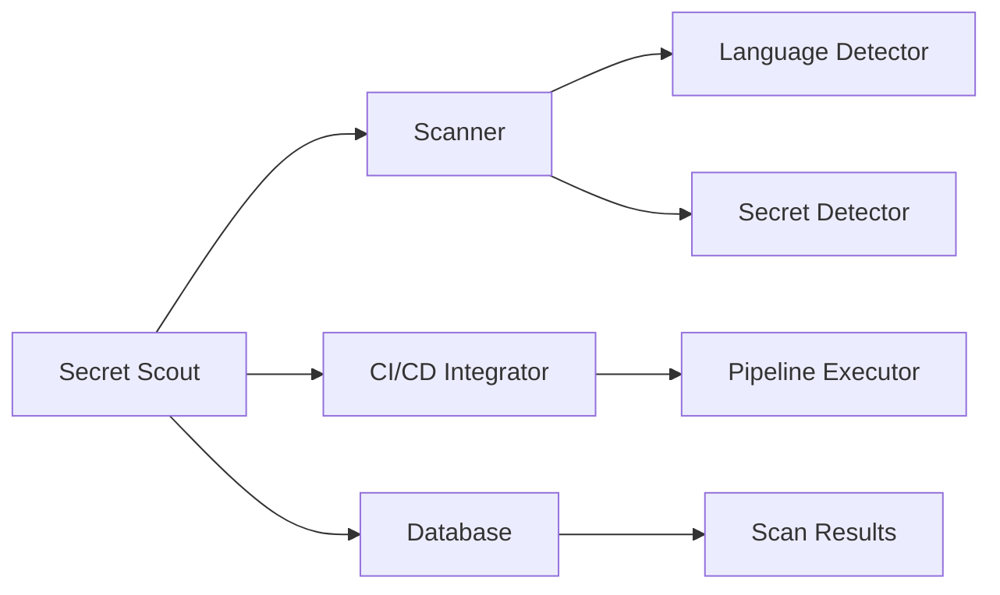

## System Overview

Secret Scout is a static analysis tool designed to scan codebases for hardcoded secrets, such as API keys, passwords, and tokens, and report their locations with severity levels. It integrates with CI/CD pipelines to prevent secret leakage, providing an easy-to-use, multi-language secret scanner that can be integrated early in the development cycle. The tool aims to address a critical security need by detecting hard-coded secrets across codebases.

## Component Diagram (Mermaid)



## Data Flow

1. **Codebase Input**: The user provides a codebase for scanning.
2. **Language Detection**: The Scanner component detects the programming language(s) used in the codebase.
3. **Secret Scanning**: The Secret Detector component scans the codebase for hardcoded secrets.
4. **Severity Level Assignment**: The Secret Detector assigns a severity level to each detected secret.
5. **Scan Results Storage**: The scan results, including detected secrets and their severity levels, are stored in the Database.
6. **CI/CD Integration**: The CI/CD Integrator component integrates with the user's CI/CD pipeline, executing the scan and reporting results.
7. **Alerting and Reporting**: The tool generates alerts and reports for detected secrets, providing actionable information for the development team.

## File/Folder Structure

```plaintext
secret_scout/
├── src/
│   ├── scanner/
│   │   ├── language_detector.py
│   │   ├── secret_detector.py
│   │   └── scanner.py
│   ├── ci_cd_integrator/
│   │   ├── pipeline_executor.py
│   │   └── ci_cd_integrator.py
│   ├── database/
│   │   ├── scan_results.py
│   │   └── database.py
│   ├── main.py
│   └── utils/
│       ├── logging.py
│       └── config.py
├── tests/
│   ├── test_scanner.py
│   ├── test_ci_cd_integrator.py
│   ├── test_database.py
│   └── test_utils.py
├── config/
│   ├── settings.py
│   └── logging_config.py
├── requirements.txt
└── README.md
```

## Key Technical Decisions + Justification

1. **Programming Language**: Python was chosen due to its extensive libraries and community support for static analysis and CI/CD integration.
2. **Static Analysis Framework**: PyLint or PyFlakes can be used as a foundation for scanning codebases and detecting hardcoded secrets.
3. **CI/CD Integration**: GitHub Actions or Jenkins were selected for seamless integration with popular version control systems and CI/CD pipelines.
4. **Database**: SQLite or MongoDB were chosen for storing scan results and severity levels, providing a flexible and scalable data storage solution.
5. **Modular Architecture**: A modular design was adopted to facilitate easy integration with various CI/CD pipelines and to enable the addition of new features and languages.

## What FORGE Needs to Know to Start Coding

1. **Programming Language**: Python 3.9+
2. **Required Libraries**: PyLint, PyFlakes, GitHub Actions or Jenkins, SQLite or MongoDB
3. **Database Schema**: A schema for storing scan results and severity levels
4. **CI/CD Pipeline Configuration**: Configuration files for integrating with CI/CD pipelines
5. **Language Support**: A list of programming languages to support initially, with a plan for adding more languages in the future

By following this design, Secret Scout can effectively detect hardcoded secrets and prevent secret leakage, providing a valuable tool for development teams and security-conscious developers.